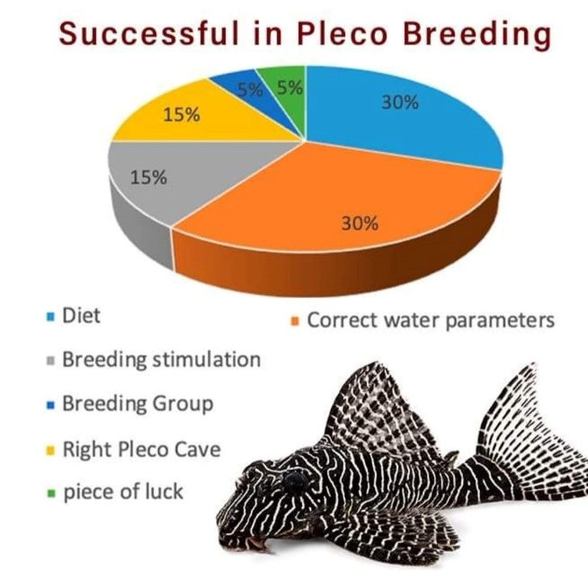
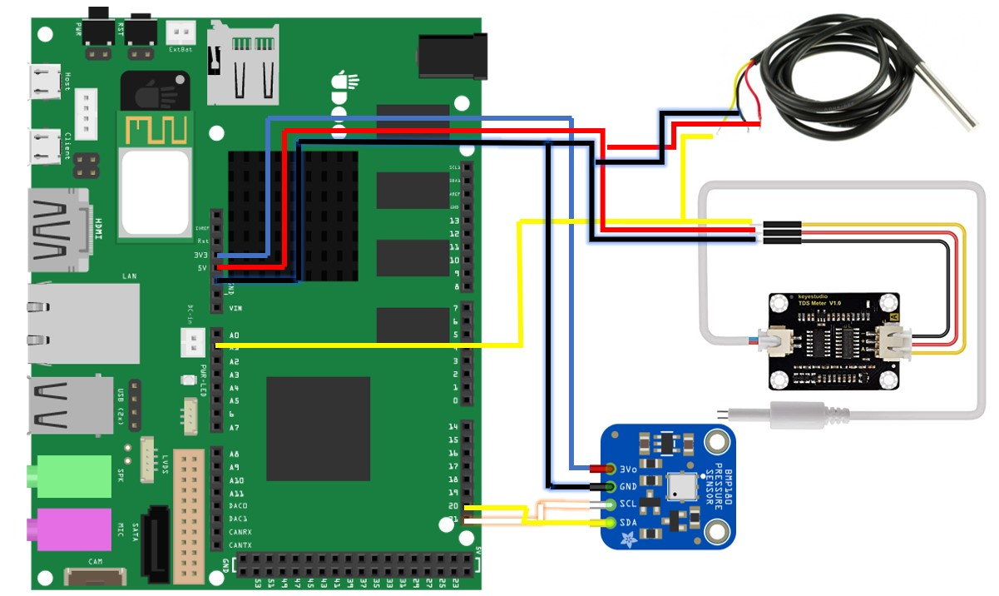
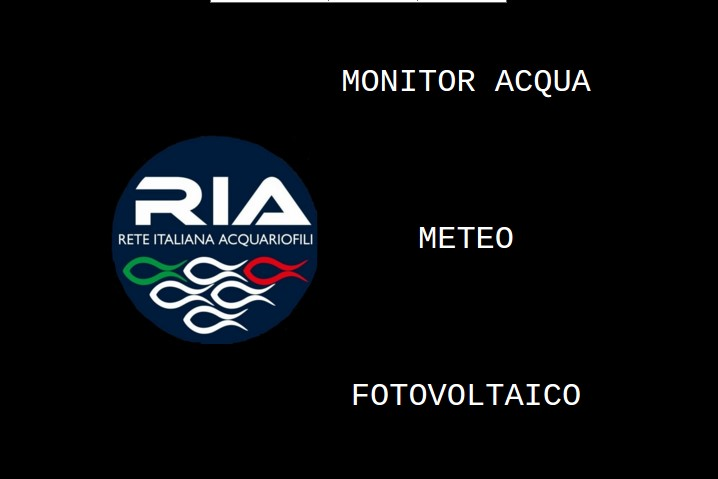
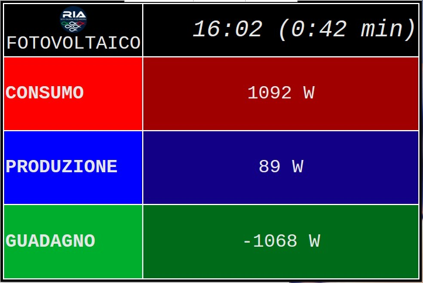
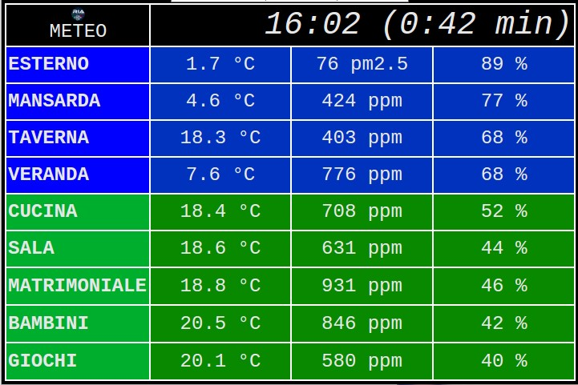
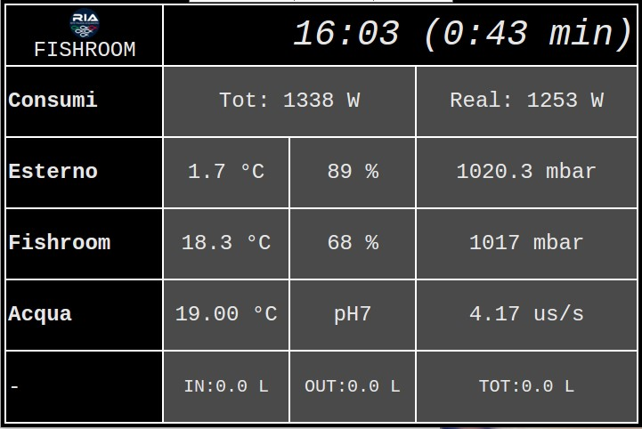

# PBA: Pleco Breeding Assistant
A small monitor that reports the external, fishroom and water change parameters to have suitable water parameters and induce breeding. These two features already represent 50% of the "reproductive success of Pleco". 

Everything has been realized with a **UDOO Quad board**.
UDOO DUAL/QUAD is a single board computer that can run Android or Linux OS, and also features an Arduino-compatible microcontroller embedded onboard. It is a powerful prototyping board for software development and design. Easy to use, it allows to develop projects with minimum knowledge of hardware design. UDOO DUAL/QUAD merges different computing worlds together: each one has its proper strengths and weak points, but all of them are useful in todays life for educational purposes as well as Do-It-Yourself (DIY) and quick prototyping. UDOO DUAL/QUAD is an open hardware, low-cost platform equipped with an ARM i.MX6 NXP® processor, and an Arduino Due compatible section based on ATMEL SAM3X8E ARM processor, all this available on the same board!

The Arduino has been used with the following sensors:
- **BMP180** Temperature and pressure sensor
- **TDS** Conductivity sensor
- **DS18B20** Immersion temperature sensor
- **Netatmo** Environmental sensors
- **Engage Efergy** Consumption sensors
- **YF-S201** Flow Meter
 
The wiring diagram is as follows

To visualize the data instead it has been realized a python script to collect data from various sensors and display them through a dedicated web page

*Main Menu*

*"Fotovoltaico" section*

*"Meteo" section*

*"Monitor Acqua" section*

The monitor shows
- The current consumption necessary to heat the water in the exchange tank
- Temperature, humidity and external pressure
- Temperature, humidity and pressure in the fish room
- Temperature and conductivity in the exchange tank
- An icon showing if it is raining
- An icon that lights up in "green" in case there are conditions to stimulate reproduction (low fishroom pressure, rain, low conductivity of the exchange water, low exchange water temperature)
